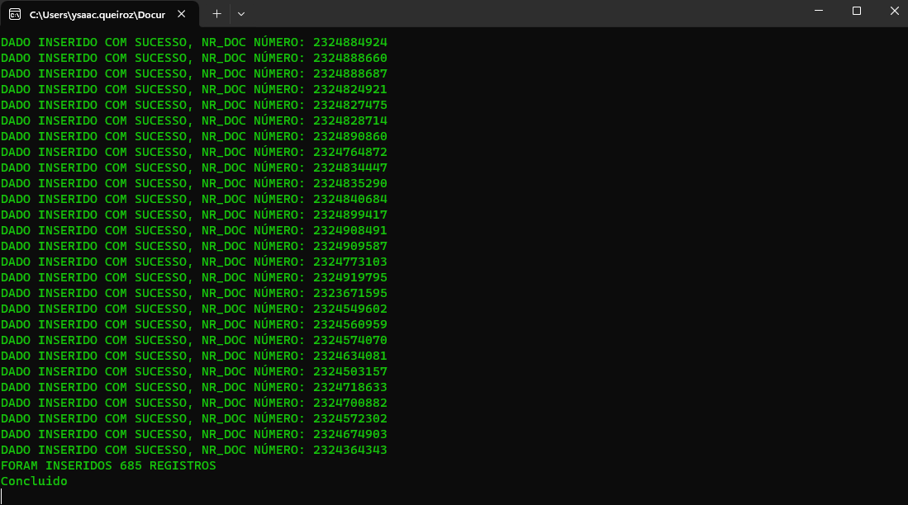
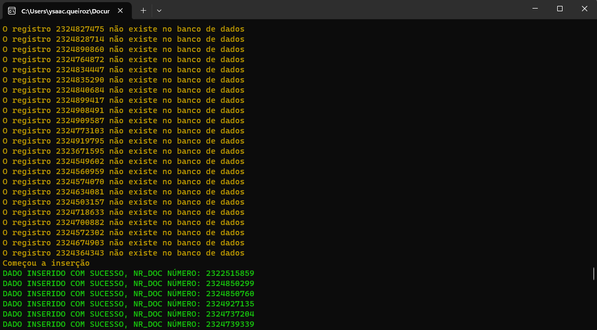

### Migrador de Dados Oracle para SQL Server

## Funcionalidades Principais:

* Leitura de Dados Oracle: O aplicativo se conecta ao banco de dados Oracle e extrai os dados da tabela especificada.
* Inserção no SQL Server: Os dados extraídos do Oracle são inseridos em uma tabela correspondente no SQL Server.
* Contagem de dados: A aplicação verifica quantos registros há na tabela do Oracle e na tabela do SQL Server, de acordo com uma consulta parametrizada e filtrada, e verifica quantos registros faltam ser inseridos no SQL Server.
* Verificação de dados: A aplicação verifica a existência dos dados na tabela no SQL Server para assim evitar dados duplicados.
